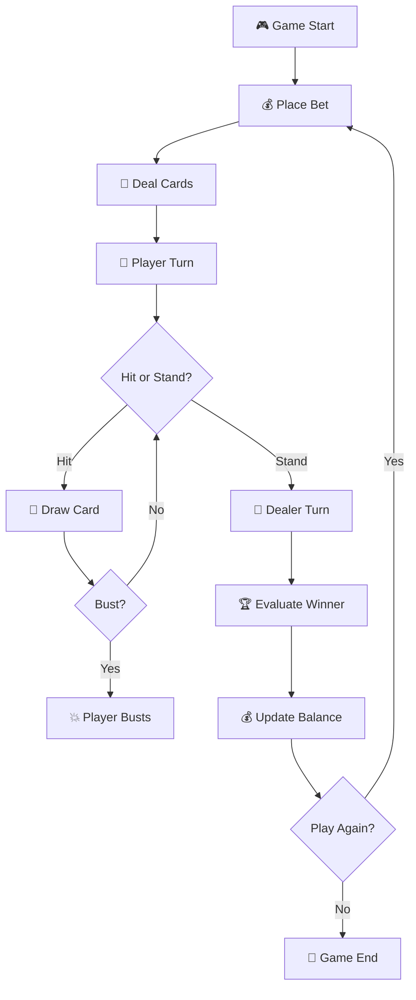

# 🃏 Professional Blackjack 21 Game

[](https://www.oracle.com/java/)
[](https://junit.org/)
[](https://en.wikipedia.org/wiki/Object-oriented_programming)
[](https://en.wikipedia.org/wiki/SOLID)

> **A sophisticated, enterprise-grade Blackjack implementation showcasing advanced Java OOP principles and clean architecture patterns.**

---

## 🚀 **Why This Project Stands Out**

This isn't just another card game – it's a **professional software engineering showcase** demonstrating:

- ✨ **Clean Architecture** with SOLID principles
- 🧪 **Test-Driven Development** with comprehensive JUnit testing
- 🎯 **Enterprise-Ready Code** structure and documentation
- 🔄 **Extensible Design** for future enhancements
- 💡 **Real-World Problem Solving** with elegant solutions

---

## 🎮 **Core Features**

| Feature | Description | Technical Highlight |
|---------|-------------|-------------------|
| 🎯 **Full Blackjack Rules** | Complete game logic with standard casino rules | Advanced scoring algorithms |
| 🤖 **Intelligent Dealer AI** | Automated dealer following house rules | Strategy pattern implementation |
| 💰 **Betting System** | Dynamic balance management | State management & validation |
| 🎴 **Smart Card Handling** | Ace value adjustment & bust detection | Complex conditional logic |
| 🎨 **Clean UI** | Console-based with intuitive card display | User experience design |
| 🧩 **Modular Architecture** | Easily extendable for AI players or GUIs | Separation of concerns |

---

## 🏗️ **Technical Architecture**

### **Project Structure**
```
Black_Jack21/
├── 🎮 BlackJackMain.java          # Application entry point
├── 🎯 BlackjackRound.java         # Game flow controller
├── 👤 Player.java                 # Abstract base class
├── 🧑 HumanPlayer.java            # User interaction & betting logic
├── 🤖 Dealer.java                 # AI dealer implementation
├── 🎴 Deck.java                   # Card management system
├── 🃏 Card.java                   # Single card representation
├── ♠️ CardSuit.java               # Enum for suits
├── 🔢 CardRank.java               # Enum for ranks with values
├── ✋ Hand.java                   # Hand scoring & management
└── 🧪 tests/HandTest.java         # Comprehensive unit tests
```

### **Design Patterns Used**
- **Strategy Pattern** → Dealer AI behavior
- **Template Method** → Player turn structure
- **Factory Pattern** → Card creation
- **Observer Pattern** → Game state updates

---

## 💻 **OOP & SOLID Principles Showcase**

<details>
<summary><b>🔍 Click to expand technical details</b></summary>

### **Object-Oriented Programming Mastery**

| Principle | Implementation | Business Value |
|-----------|----------------|----------------|
| **🔒 Encapsulation** | Private fields with controlled access | Data integrity & security |
| **🎭 Abstraction** | Abstract `Player` class with `takeTurn()` | Code maintainability |
| **🧬 Inheritance** | `HumanPlayer` & `Dealer` extend `Player` | Code reusability |
| **🔄 Polymorphism** | Same interface for different player types | Flexible architecture |

### **SOLID Principles in Action**

| Principle | Implementation | Future-Proof Benefit |
|-----------|----------------|---------------------|
| **S** - Single Responsibility | Each class has one clear purpose | Easy debugging & maintenance |
| **O** - Open/Closed | Add new features without modifying existing code | Scalable architecture |
| **L** - Liskov Substitution | Players interchangeable through base class | Robust inheritance |
| **I** - Interface Segregation | Focused interfaces for specific behaviors | Clean dependencies |
| **D** - Dependency Inversion | High-level modules don't depend on low-level | Testable & flexible |

</details>

---

## 🎯 **Game Flow Architecture**



---

## 🧪 **Quality Assurance**

### **Testing Strategy**
- ✅ **Unit Tests** with JUnit 5
- ✅ **Edge Cases** covered (Ace handling, busts, pushes)
- ✅ **Code Coverage** for critical game logic
- ✅ **Integration Tests** for game flow

### **Test Examples**
```java
@Test
public void testBlackjackScenario() {
    Hand hand = new Hand();
    hand.addCard(new Card(CardSuit.SPADES, CardRank.ACE));
    hand.addCard(new Card(CardSuit.HEARTS, CardRank.KING));
    assertEquals(21, hand.getScore());
    assertTrue(hand.isBlackjack());
}
```

---

## 🚀 **Quick Start Guide**

### **Prerequisites**
- Java 8+ installed
- JUnit 5 for testing
- IDE (IntelliJ IDEA, Eclipse, or VS Code)

### **Installation & Execution**
```bash
# Clone the repository
git clone https://github.com/yourusername/blackjack-21.git

# Navigate to project directory
cd Black_Jack21

# Compile the project
javac -d out src/Black_Jack/*.java

# Run the game
java -cp out Black_Jack.BlackJackMain

# Run tests
java -cp out:junit-platform-console-standalone.jar org.junit.platform.console.ConsoleLauncher
```

---

## 📸 **Demo Screenshot**

```
🎲 ========= BLACKJACK 21 =========
💰 Your Balance: $100
💸 Place your bet: $25

🎴 Your Hand: ♠A ♥K (Score: 21) 🎯 BLACKJACK!
🤖 Dealer: ♣7 ♦10 (Score: 17)

🏆 You Win! +$37.50
💰 New Balance: $137.50

🎯 Play another round? (y/n):
```

---

## 🔮 **Future Enhancements Roadmap**

| Phase | Feature | Technical Challenge |
|-------|---------|-------------------|
| **Phase 1** | 🤖 AI Player with Basic Strategy | Machine learning algorithms |
| **Phase 2** | 🖼️ JavaFX GUI | Event-driven programming |
| **Phase 3** | 🌐 Multiplayer Support | Network programming |
| **Phase 4** | 📊 Analytics Dashboard | Data visualization |
| **Phase 5** | 🎮 Mobile App | Cross-platform development |

---

## 💼 **Professional Impact**

This project demonstrates **real-world software engineering skills** that employers value:

- 🎯 **Problem-Solving**: Complex game logic with edge cases
- 🏗️ **Architecture**: Scalable, maintainable code structure
- 🧪 **Testing**: Quality assurance and reliability
- 📚 **Documentation**: Clear, professional communication
- 🔄 **Best Practices**: Industry-standard coding patterns

---

## 🤝 **Let's Connect**

Created with ❤️ by **Hashim AbdElaziz**

[](https://www.linkedin.com/in/hashim-abdulaziz-095b68281/)
[](https://github.com/yourusername)(https://github.com/HashimAbdulaziz))
[](hashimzezo222@gmail.com)

---

## 📜 **License**

This project is licensed under the MIT License - see the [LICENSE](LICENSE) file for details.

---

<div align="center">

### 🎯 **"Great code is its own best documentation"** 

*This project showcases not just what I can build, but how I think about software architecture, testing, and professional development practices.*

**⭐ Star this repo if you found it helpful!**

</div>
